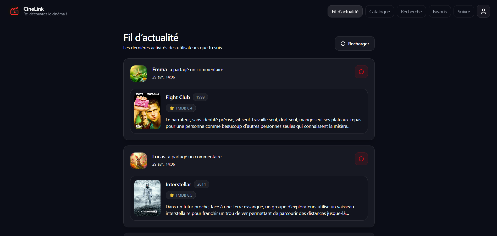
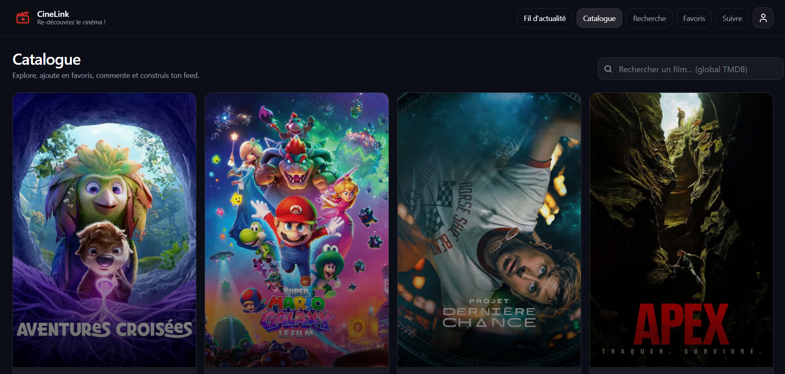
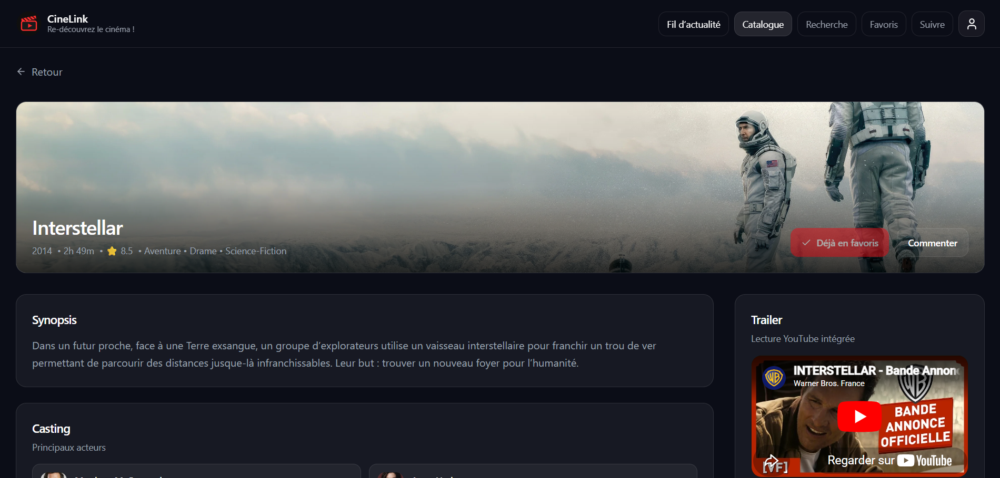
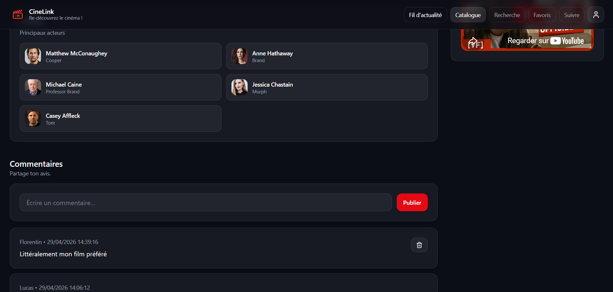
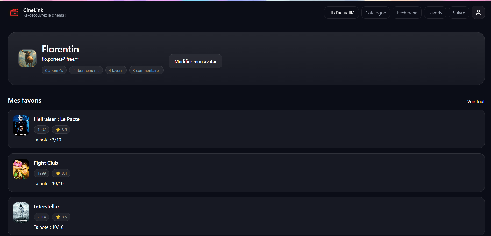

# CineLink 🎬

> **Plateforme sociale de cinéma** - Découvrez, notez et partagez vos films préférés avec une communauté passionnée.

[](https://nodejs.org/)
[](https://www.typescriptlang.org/)
[](https://reactjs.org/)
[](https://www.mongodb.com/)
[](https://www.docker.com/)

## 📋 Table des matières

- [🎯 Présentation](#-présentation)
- [🛠️ Stack technique](#️-stack-technique)
- [🏗️ Architecture](#️-architecture)
- [📸 Screenshots](#-screenshots)
- [🌐 Liens de production](#-liens-de-production)
- [🚀 Installation & Lancement](#-installation--lancement)
- [🐳 Docker](#-docker)
- [🔄 CI/CD](#-cicd)
- [🧪 Tests](#-tests)
- [📁 Structure du monorepo](#-structure-du-monorepo)
- [🔧 Backend](#-backend)
- [🎨 Frontend](#-frontend)
- [📝 Licence](#-licence)
- [📋 Documentation de certification](#-documentation-de-certification)

---

## 🎯 Présentation

**CineLink** est une plateforme web moderne permettant aux cinéphiles de :

- 🔍 **Découvrir** des films populaires via l'API TMDB
- ⭐ **Noter** et gérer ses films favoris (0-10)
- 💬 **Commenter** et échanger sur les films
- 👥 **Suivre** d'autres utilisateurs
- 📱 **Consulter** un fil d'actualité personnalisé
- 🎭 **Personnaliser** son profil avec des avatars

Développé en **monorepo** avec une séparation claire entre backend API REST et frontend React moderne.

### ✨ Fonctionnalités clés

- **Authentification JWT** sécurisée
- **Recherche avancée** de films et utilisateurs
- **Système social** complet (follow, commentaires)
- **Interface responsive** et moderne
- **Architecture scalable** et maintenable
- **Tests automatisés** complets
- **Conteneurisation Docker** prête pour le déploiement

---

## 🛠️ Stack technique

### Backend
- **Runtime** : Node.js 20 LTS
- **Langage** : TypeScript (strict mode)
- **Framework** : Express.js
- **Base de données** : MongoDB avec Mongoose
- **Authentification** : JWT (jsonwebtoken)
- **Validation** : express-validator
- **Tests** : Jest + Supertest
- **Conteneurisation** : Docker + Docker Compose

### Frontend
- **Runtime** : Node.js 20 LTS
- **Framework** : React 19
- **Build tool** : Vite 7
- **Langage** : TypeScript (strict mode)
- **Routing** : React Router v6
- **Styling** : Tailwind CSS 4
- **HTTP Client** : Axios
- **Forms** : React Hook Form + Zod
- **Notifications** : Sonner
- **Qualité** : ESLint

### DevOps & Qualité
- **Conteneurisation** : Docker & Docker Compose
- **Linting** : ESLint
- **CI/CD** : GitHub Actions (non versionné)
- **Tests** : Jest + Vitest
- **Type checking** : TypeScript strict

---

## 🏗️ Architecture

```
CineLink (Monorepo)
├── cinelink-backend/          # API REST Node.js/Express
│   ├── src/
│   │   ├── app.ts            # Configuration Express
│   │   ├── server.ts         # Point d'entrée
│   │   ├── config/db.ts      # Connexion MongoDB
│   │   ├── routes/           # Définition des endpoints
│   │   ├── controllers/      # Logique métier
│   │   ├── models/           # Schémas Mongoose
│   │   ├── middlewares/      # Auth, validation
│   │   └── utils/            # Fonctions utilitaires
│   ├── tests/                # Tests backend
│   └── scripts/seed.ts       # Données de démo
│
└── cinelink-frontend/         # Application React/Vite
    ├── src/
    │   ├── app/              # Routing & guards
    │   ├── components/ui/    # Composants réutilisables
    │   ├── features/         # Features métier
    │   ├── lib/              # Utilitaires
    │   └── services/         # API client & storage
    ├── public/               # Assets statiques
    └── test/                 # Tests frontend
```

### 🏛️ Principes architecturaux

- **Séparation des responsabilités** : Backend API / Frontend UI
- **Architecture hexagonale** côté backend
- **Feature-driven development** côté frontend
- **Type safety** complète avec TypeScript
- **Tests first** approach
- **Container-ready** pour tous les environnements

---

## 📸 Screenshots

### Interface principale

*Fil d'actualité personnalisé avec les activités des utilisateurs suivis*

### Catalogue de films

*Catalogue des films populaires avec recherche intégrée*

### Détail d'un film


*Détail complet d'un film avec synopsis, casting et commentaires*

### Profil utilisateur

*Profil utilisateur avec statistiques sociales et favoris*

---

## 🌐 Liens de production

- **Application** : [https://cine-link-lemon.vercel.app/](https://cine-link-lemon.vercel.app/)
- **API Backend** : [https://cinelink-backend.onrender.com](https://cinelink-backend.onrender.com)

### ⚠️ Note sur les plans gratuits

L'application est actuellement déployée sur des plans gratuits :
- **Frontend** : Vercel (plan gratuit)
- **Backend** : Render (plan gratuit)
- **Base de données** : MongoDB Atlas (tier gratuit)

**Impact** : En raison de ces plans gratuits, les ressources sont suspendues après 15 minutes d'inactivité. La première requête après inactivité peut donc faire prendre du temps (10-15 secondes) pour réactiver l'ensemble des services.

**Recommandation pour la production** : Pour une application en production, utiliser des plans payants avec instances toujours actives pour garantir des temps de réponse optimaux.

---

## 🚀 Installation & Lancement

### Prérequis

- **Node.js** ≥ 20.0.0
- **npm** ≥ 9.0.0
- **MongoDB** (local ou Atlas)
- **Docker** (optionnel, recommandé)

### Installation rapide

```bash
# Cloner le repository
git clone https://github.com/username/cinelink.git
cd cinelink

# Installer les dépendances
npm install
cd cinelink-backend && npm install
cd ../cinelink-frontend && npm install
```

### Configuration

Créer les fichiers `.env` dans chaque projet :

**Backend** (`.env` dans `cinelink-backend/`) :
```env
PORT=3000
MONGO_URI=mongodb://localhost:27017/cinelink
JWT_SECRET=your_super_secret_jwt_key_here
JWT_EXPIRES_IN=1h
TMDB_API_KEY=your_tmdb_api_key
FRONTEND_URL=http://localhost:5173
```

**Frontend** (`.env` dans `cinelink-frontend/`) :
```env
VITE_API_URL=http://localhost:3000
```

### Lancement en développement

```bash
# Terminal 1 : Backend
cd cinelink-backend
npm run dev

# Terminal 2 : Frontend
cd cinelink-frontend
npm run dev
```

L'application sera accessible sur :
- **Frontend** : http://localhost:5173
- **Backend API** : http://localhost:3000

### Données de démo

Pour tester rapidement avec des données :

```bash
cd cinelink-backend
npm run seed:dev
```

Comptes de démo disponibles :
- `florentin.demo@cinelink.fr` / `CineLink2026!`
- `alice.demo@cinelink.fr` / `CineLink2026!`
- `lucas.demo@cinelink.fr` / `CineLink2026!`
- `emma.demo@cinelink.fr` / `CineLink2026!`

---

## 🐳 Docker

### Lancement complet avec Docker Compose

```bash
# Depuis la racine du monorepo
docker compose up --build
```

Services exposés :
- **Frontend** : http://localhost:5173
- **Backend API** : http://localhost:3000
- **MongoDB** : mongodb://localhost:27017

### Images Docker individuelles

```bash
# Backend uniquement
cd cinelink-backend
docker build -t cinelink-backend .
docker run -p 3000:3000 cinelink-backend

# Frontend uniquement
cd cinelink-frontend
docker build -t cinelink-frontend .
docker run -p 5173:5173 cinelink-frontend
```

---

## 🔄 CI/CD

### Pipeline GitHub Actions (non versionnée)

Le projet est configuré pour une CI/CD automatisée incluant :

- **Linting** : ESLint sur frontend et backend
- **Tests** : Jest pour backend, Vitest pour frontend
- **Build** : Compilation TypeScript et build de production
- **Sécurité** : Audit des dépendances npm
- **Déploiement** : Vers Vercel (frontend) et Render (backend)

### Monitoring et observabilité

**Note** : Le monitoring et l'observabilité en production seront implémentés lors du **Bloc 3 (Assurer la continuité de service)** de cette formation. 

Les outils suivants sont prévus pour améliorer la visibilité en production :
- Application Performance Monitoring (APM)
- Logs centralisés
- Alertes et métriques
- Dashboard de suivi

### Déploiement manuel

```bash
# Backend
cd cinelink-backend
npm run build
npm start

# Frontend
cd cinelink-frontend
npm run build
npm run preview
```

---

## 🧪 Tests

### Backend

```bash
cd cinelink-backend
npm test              # Tests unitaires + intégration
npm run test:watch    # Mode watch
npm run test:coverage # Rapport de couverture
```

**Couverture** : Routes API, contrôleurs, modèles, middlewares, utilitaires.

### Frontend

```bash
cd cinelink-frontend
npm run test          # Tests unitaires (Vitest)
npm run test:ui       # Tests E2E (Playwright - si configuré)
```

### Qualité du code

```bash
# Linting
cd cinelink-backend && npm run lint
cd cinelink-frontend && npm run lint

# Type checking
cd cinelink-backend && npm run typecheck
cd cinelink-frontend && npm run build  # Inclut type-check
```

---

## 📁 Structure du monorepo

```
cinelink/
├── .github/                 # Configuration GitHub (CI/CD)
├── docs/                    # Documentation
│   └── screenshots/         # Captures d'écran
├── cinelink-backend/        # API REST
│   ├── src/
│   ├── tests/
│   ├── scripts/
│   ├── Dockerfile
│   ├── docker-compose.yml
│   └── package.json
├── cinelink-frontend/       # Application React
│   ├── src/
│   ├── public/
│   ├── test/
│   ├── vite.config.ts
│   └── package.json
├── docker-compose.yml       # Orchestration complète
├── README.md               # Cette documentation
└── package.json           # Scripts monorepo
```

---

## 🔧 Backend

### Architecture Express

Le backend suit une architecture modulaire avec séparation claire des responsabilités :

- **Routes** : Définition des endpoints REST
- **Contrôleurs** : Logique métier et gestion des réponses
- **Modèles** : Schémas de données MongoDB/Mongoose
- **Middlewares** : Authentification, validation, erreurs
- **Utils** : Fonctions utilitaires réutilisables

### API Endpoints

Les routes protégées nécessitent `Authorization: Bearer <token>`.

#### Authentification
| Méthode | Endpoint | Description |
|---------|----------|-------------|
| POST | `/api/auth/register` | Inscription (`name`, `email`, `password`, `avatar?`) |
| POST | `/api/auth/login` | Connexion (`email`, `password`) |

#### Films
| Méthode | Endpoint | Description |
|---------|----------|-------------|
| GET | `/api/movies/popular` | Films populaires |
| GET | `/api/movies/:id` | Détails d'un film |

#### Recherche & Utilisateurs
| Méthode | Endpoint | Description |
|---------|----------|-------------|
| GET | `/api/search?query=` | Recherche de films |
| GET | `/api/users/all` | Liste utilisateurs |
| GET | `/api/users?query=` | Recherche utilisateurs |
| GET | `/api/users/:id` | Profil utilisateur |

#### Fonctionnalités sociales
| Méthode | Endpoint | Description |
|---------|----------|-------------|
| POST | `/api/favorites` | Ajouter favori |
| GET | `/api/favorites` | Mes favoris |
| PUT | `/api/favorites/:id/rate` | Noter favori (0-10) |
| DELETE | `/api/favorites/:id` | Supprimer favori |
| POST | `/api/comments` | Commenter film |
| GET | `/api/comments/:movieId` | Commentaires film |
| DELETE | `/api/comments/:id` | Supprimer commentaire |
| POST | `/api/follow/:id` | Suivre utilisateur |
| DELETE | `/api/follow/:id` | Ne plus suivre |
| GET | `/api/follow` | Mes abonnements |
| GET | `/api/feed` | Fil d'actualité |

### Sécurité

- **Authentification JWT** avec expiration
- **Validation stricte** des entrées (express-validator)
- **Protection CSRF** implicite (JWT stateless)
- **Rate limiting** recommandé en production
- **Audit logs** pour les actions sensibles
- **Secrets** non versionnés (variables d'environnement)

### Variables d'environnement

| Variable | Description | Exemple |
|----------|-------------|---------|
| `PORT` | Port d'écoute | `3000` |
| `MONGO_URI` | URI MongoDB | `mongodb://localhost:27017/cinelink` |
| `JWT_SECRET` | Clé secrète JWT | `your_super_secret_key` |
| `JWT_EXPIRES_IN` | Expiration JWT | `1h` |
| `TMDB_API_KEY` | Clé API TMDB | `your_tmdb_key` |
| `FRONTEND_URL` | URL frontend | `http://localhost:5173` |

---

## 🎨 Frontend

### Architecture React

Application React moderne organisée en features :

```
src/
├── app/                    # Configuration globale
│   ├── AppShell.tsx       # Layout principal
│   ├── RequireAuth.tsx    # Guard d'authentification
│   └── router.tsx         # Configuration des routes
├── components/ui/         # Composants UI réutilisables
│   ├── button.tsx
│   ├── input.tsx
│   ├── card.tsx
│   └── ...
├── features/              # Features métier
│   ├── auth/              # Authentification
│   ├── movies/            # Gestion des films
│   ├── favorites/         # Favoris et notation
│   ├── comments/          # Commentaires
│   ├── users/             # Profils utilisateurs
│   ├── search/            # Recherche
│   └── feed/              # Fil d'actualité
├── lib/                   # Utilitaires
│   ├── jwt.ts             # Gestion JWT
│   ├── api-error.ts       # Gestion erreurs API
│   └── utils.ts           # Fonctions utilitaires
└── services/              # Services externes
    ├── api.ts             # Client HTTP Axios
    └── auth.storage.ts    # Stockage token
```

### Routing

#### Routes publiques
- `/` → Redirection vers `/login`
- `/login` → Page de connexion
- `/register` → Page d'inscription

#### Routes protégées (`/app/*`)
- `/app/feed` → Fil d'actualité
- `/app/movies` → Catalogue films populaires
- `/app/movies/:id` → Détail film + commentaires
- `/app/search` → Recherche de films
- `/app/favorites` → Gestion favoris
- `/app/users` → Découverte utilisateurs
- `/app/users/:id` → Profil utilisateur
- `/app/following` → Liste abonnements
- `/app/me` → Mon profil

### Authentification & Session

- **Stockage** : Token JWT dans `localStorage`
- **Intercepteur Axios** : Injection automatique du header `Authorization`
- **Protection routes** : Composant `RequireAuth` bloque l'accès sans token
- **Expiration** : Gestion automatique de la déconnexion

### Tests

Configuration Vitest pour les tests unitaires :

```bash
npm run test          # Exécution des tests
npm run test:watch    # Mode watch
npm run test:coverage # Couverture
```

### Déploiement Vercel

Le frontend est optimisé pour Vercel :

- **Build command** : `npm run build`
- **Output directory** : `dist`
- **Environment variables** :
  - `VITE_API_URL` : URL de l'API backend

---

## 📝 Licence

Ce projet est sous licence MIT - voir le fichier [LICENSE](LICENSE) pour plus de détails.

---

## 🤝 Contribution

1. Fork le projet
2. Créer une branche feature (`git checkout -b feature/AmazingFeature`)
3. Commit les changements (`git commit -m 'Add some AmazingFeature'`)
4. Push vers la branche (`git push origin feature/AmazingFeature`)
5. Ouvrir une Pull Request

### Standards de code

- **TypeScript strict** activé
- **ESLint** pour la qualité
- **Tests** requis pour les nouvelles features
- **Commits** conventionnels

---

## 📞 Support

- **Issues** : [GitHub Issues](https://github.com/username/cinelink/issues)
- **Discussions** : [GitHub Discussions](https://github.com/username/cinelink/discussions)
- **Email** : contact@cinelink.dev

---

*Développé avec ❤️ pour la communauté cinéphile*

---

## 📋 Documentation de certification

Ce projet CineLink est développé dans le cadre de la certification Bloc 2. La documentation complète comprend les livrables suivants :

### 📊 Critères de qualité et de performance
**[CRITERES_QUALITE.md](./CRITERES_QUALITE.md)** - Définition des critères de qualité, métriques de performance, seuils d'acceptation et plan d'amélioration continue.

### ♿ Actions d'accessibilité
**[ACCESSIBILITE.md](./ACCESSIBILITE.md)** - Mesures mises en œuvre pour l'accessibilité WCAG 2.1 AA, technologies supportées et plan d'amélioration.

### 📝 Historique des versions
**[CHANGELOG.md](./CHANGELOG.md)** - Historique complet des versions avec description des changements, ajouts et corrections.

### 🧪 Cahier de recettes
**[CAHIER_RECETTES.md](./CAHIER_RECETTES.md)** - Scénarios de tests détaillés, méthodologie de test et matrice de traçabilité pour valider les fonctionnalités.

### 🐛 Plan de correction des bogues
**[PLAN_CORRECTION_BUGS.md](./PLAN_CORRECTION_BUGS.md)** - Stratégie de gestion des bogues, processus de résolution et métriques de suivi.

### 👤 Manuel d'utilisation
**[MANUEL_UTILISATEUR.md](./MANUEL_UTILISATEUR.md)** - Guide complet pour les utilisateurs finaux avec tutoriels, bonnes pratiques et dépannage.

### 🔄 Manuel de mise à jour
**[MANUEL_MISE_A_JOUR.md](./MANUEL_MISE_A_JOUR.md)** - Procédures de déploiement, migrations de base de données et gestion des versions.

### ✅ Conformité Bloc 2

Le projet respecte tous les critères éliminatoires de certification :

- **C2.2.1** ✅ Prototype fonctionnel avec interface ergonomique
- **C2.2.2** ✅ Harnais de tests unitaires complet (Jest/Vitest)
- **C2.2.3** ✅ Code évolutif, sécurisé et accessible
- **C2.3.1** ✅ Cahier de recettes avec scénarios détaillés

---
